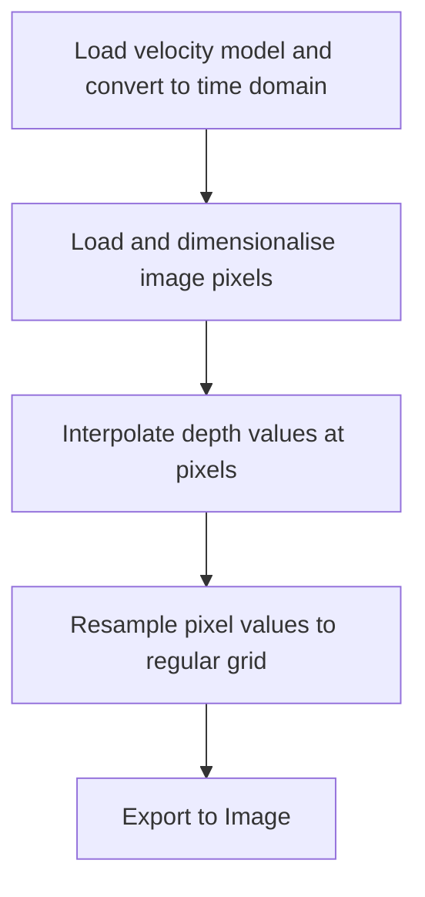

# MigrateSeismicImage.py
Apply a depth migration to a .png format seismic image

## Data
- Crop an image with known extent in x and z dimensions, and save as a .png file
- Input data must be in consistent units (e.g., m, m/sec, sec)

## Seismic velocities


## Function design

## Dependencies
- Standard python libraries (Numpy and Scipy)
- Image loading and saving requires Pillow: https://pillow.readthedocs.io/en/stable/

## Example: Depth migrate an image of seismic data using a velocity model
```
code here
```
